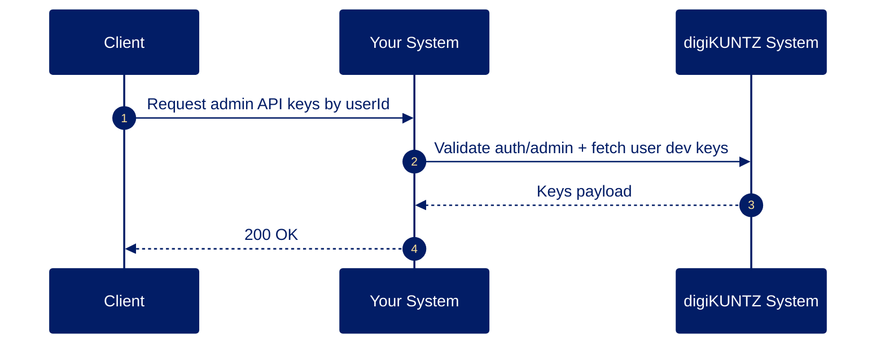
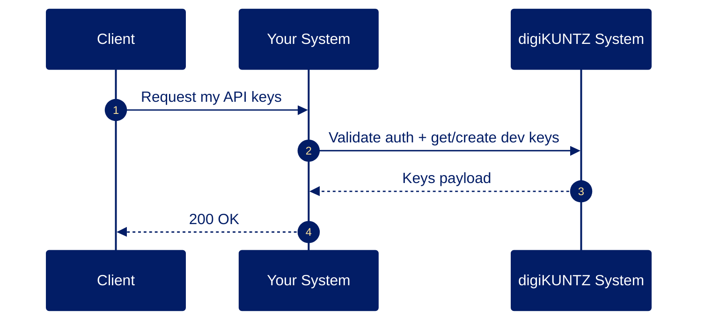
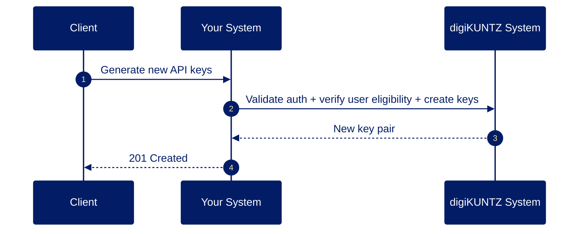
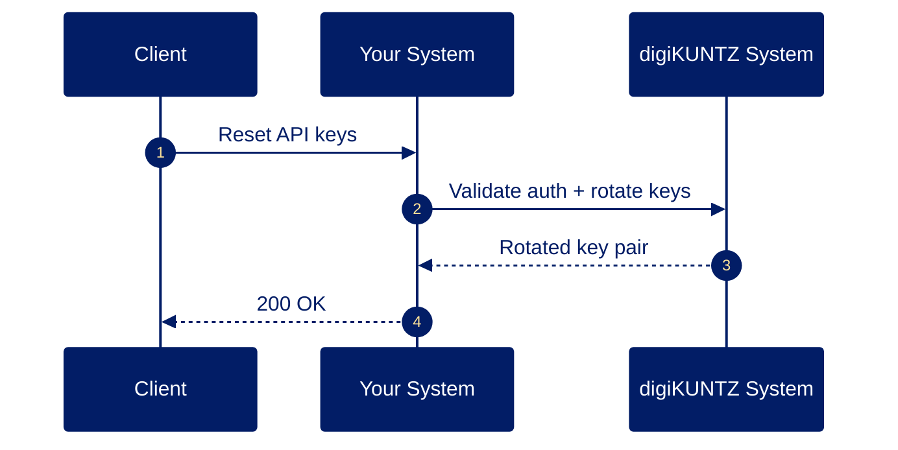
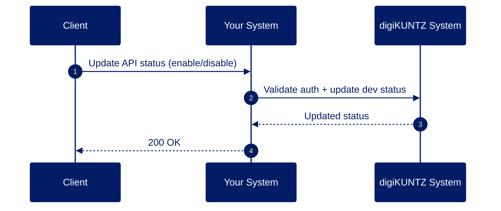
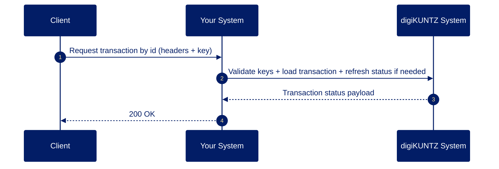
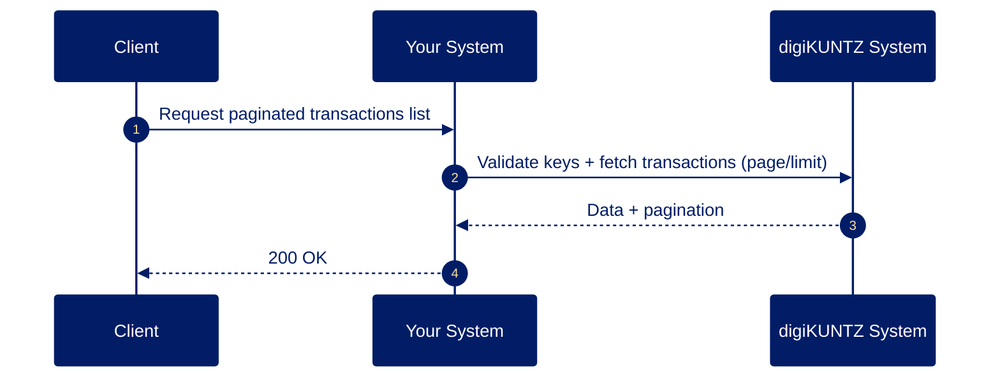
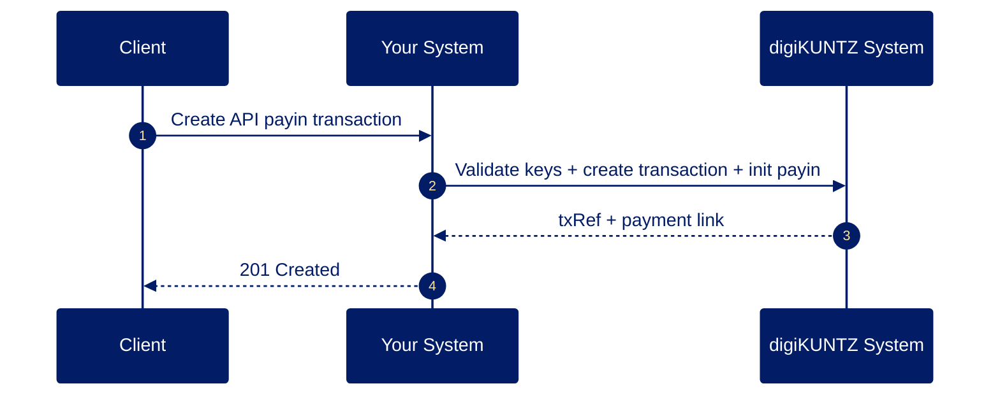
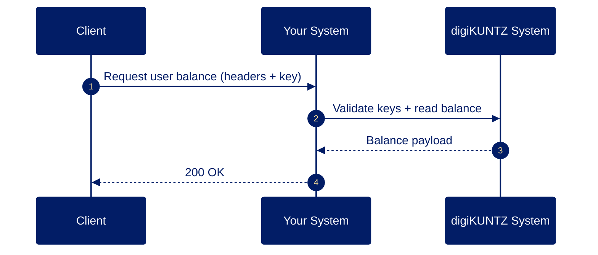

# Dev Module - Sequence Diagrams (Simplified)

Participants used in all diagrams:
- Client
- Your System
- digiKUNTZ System

## 1) `GET /dev/api-keys/:userId` (Admin)

## 2) `GET /dev/my-key`

## 3) `POST /dev/generate-key`

## 4) `PUT /dev/reset-key`

## 5) `PUT /dev/update-status`

## 6) `GET /dev/transaction`

## 7) `GET /dev/transactions-list`

## 8) `POST /dev/transaction`

## 9) `GET /dev/balance`

